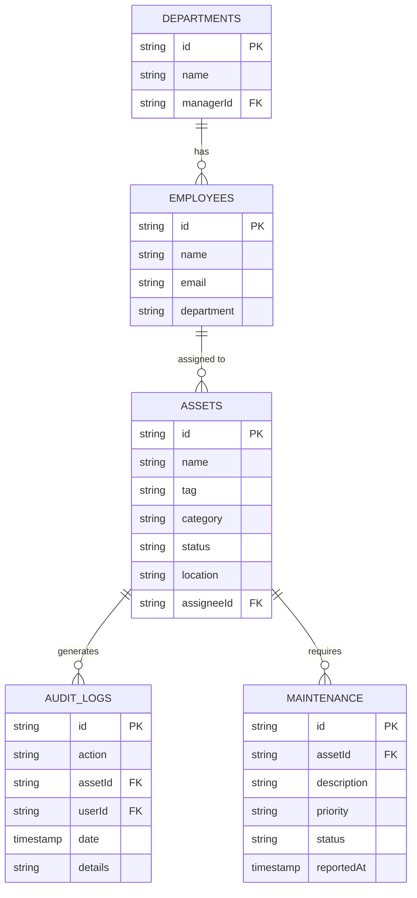
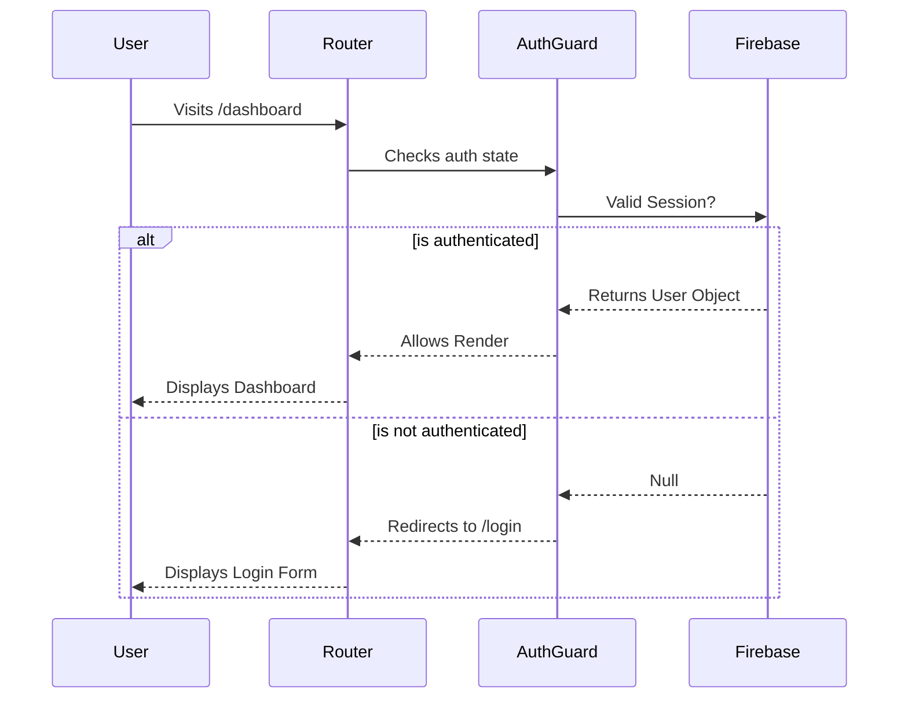
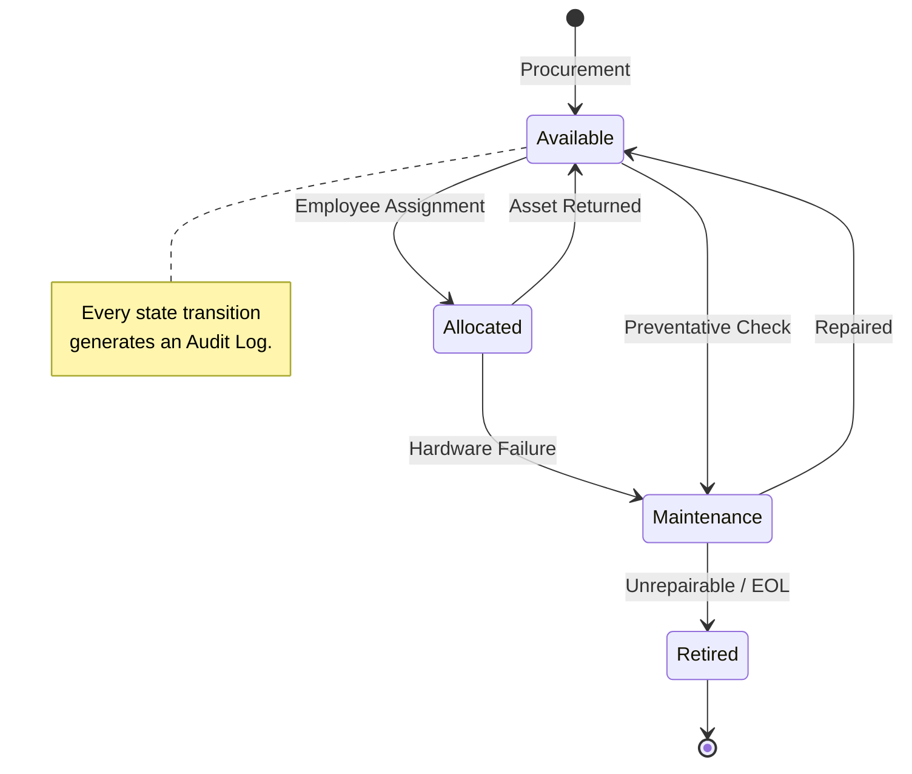
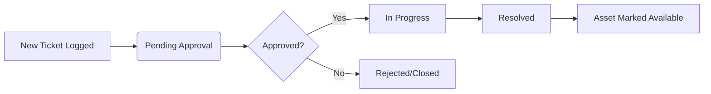

# 🏗️ AssetFlow: System Architecture

AssetFlow is designed using a decoupled, reactive architecture. This document outlines the structural layout of the frontend, backend, database schema, and interactions between the core modules.

---

## 1. High-Level Architecture

The system follows a standard 3-tier cloud-native architecture, optimized for real-time data sync via WebSockets.

```mermaid
graph TD
    subgraph Client [Client-Side (React/Vite)]
        UI[UI Components]
        Context[Auth Context]
        Hooks[Custom Data Hooks]
    end

    subgraph Firebase [Firebase Cloud]
        Auth[Firebase Auth]
        Firestore[(Firestore NoSQL)]
        Rules[Security Rules]
    end

    UI <-->|State/Props| Hooks
    Hooks <-->|WebSockets| Firestore
    Context <-->|Token/Session| Auth
    Firestore --- Rules
```

### Frontend Architecture
- **Presentation Layer**: Built with React functional components and TailwindCSS. The UI relies strictly on local state (`useState`) for transient interactions (like modals and dropdowns).
- **Data Access Layer**: All database interactions are abstracted behind custom generic hooks (`useFirestoreQuery`, `useFirestoreMutation`). The UI never imports Firebase directly. This allows us to swap the backend out entirely without rewriting components.

### Backend Architecture
- **Database**: Firebase Firestore (NoSQL document store). It provides optimistic concurrency and real-time delta updates to connected clients.
- **Authentication**: Handled via Firebase Auth, creating a secure JWT token session.
- **Hosting**: Served statically via Vercel's global CDN Edge Network.

---

## 2. Database ER Diagram

Since Firestore is NoSQL, these "Tables" represent root-level Collections. The relationships are maintained logically by storing IDs as foreign keys.



---

## 3. User Flow & Authentication

AssetFlow ensures that unauthenticated users can never access enterprise data. The Router sits behind an `AuthGuard`.



---

## 4. Asset Lifecycle & Module Interaction

When a user allocates an asset to an employee, multiple distinct modules interact to maintain system consistency.



---

## 5. Maintenance Workflow

The Maintenance module tracks repair pipelines.



---

## Summary of Abstractions

By isolating the **State**, **View**, and **Data** into distinct silos, AssetFlow achieves O(1) complexity for adding new modules. If we wish to add a "Vehicle Tracking" module tomorrow, we simply scaffold the UI, point our generic hooks at a `vehicles` collection, and the real-time sync works automatically.
